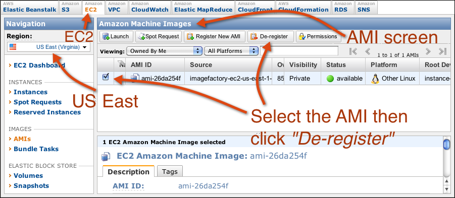

{::options parse_block_html="true" /}

Cleaning up
===========

Useful things to know when using development versions of Aeolus.

### Getting Started Guide

1.  [Basic Glossary](basic_glossary.html "Basic Glossary")
2.  [Configuring Aeolus](configuring_aeolus.html "Configuring Aeolus")
3.  [First login](first_login.html "First login")
4.  [Configure your Cloud
    Providers](configure_providers.html "Configure your Cloud Providers")
5.  [Configure the Aeolus Command Line Interface
    tool](configure_cli.html "Configure the Aeolus Command Line Interface tool")
6.  [Create a Fedora 16
    Template](make_template.html "Create a Fedora 16 Template")
7.  [Start an Instance of the
    Image](start_image.html "Start an Instance of the Image")
8.  [Stop a running Instance](stop_image.html "Stop a running Instance")
9.  Cleaning up

## Unconfiguring Aeolus

To remove all of the configuration data and database entries from an Aeolus
server, run the **aeolus-cleanup** command as a super-user:

    $ sudo /usr/sbin/aeolus-cleanup

This is useful for removing Aeolus configuration data from an existing server,
prior to running **aeolus-configure**, so is of particular interest to testers
and developers.

It only acts on the local Aeolus server, and does not communicate with any
configured Cloud providers or stop any currently-running instances. You need to
manually remove any information in configured Cloud providers.

**WARNING:** This command drops the PostgreSQL database, and permanently
deletes Conductor related data. Don't use it on a server whose data you
want to keep.

If you are using Amazon EC2, follow the next steps to complete the
cleanup.

 

## Remove any AMIs left in EC2 and storage left in S3

Aeolus does not yet de-register AMIs, nor delete their corresponding storage
from S3. For now, you will need to use the AWS Management Console to
de-register AMIs and delete S3 storage yourself.

### De-registering an AMI

Load Amazons' AWS Management Console, make sure you are in the **EC2** section,
then change to the AMIs page.

1.  Tick the checkbox next to the AMIs created by Aeolus.
2.  Click **De-register** then confirm this is what you want to do.

    

This removes the selected AMIs from your AMI list. Their storage needs to be
removed from S3 next.

### Removing S3 storage

Load Amazons' AWS Management Console, and make sure you are in the **S3**
section.

1.  Look for any buckets with "*imagefactory*" in their name, as these
    will have been created by Aeolus.
2.  For each of these buckets, delete its contents then delete the
    bucket itself.

 

## Next Steps

Aeolus has a **much richer** set of capabilities than what has been shown in
this *Getting Started Guide*.

To find out more, you can:

-   Experiment using the Aeolus web interface configured earlier.
-   Add yourself to the [Aeolus announcement mailing
    list](/contact.html#release "Aeolus announcement mailing list"), to
    receive notification of new Aeolus releases.
-   Look into the individual Aeolus component projects, starting with
    the [Aeolus Project
    Pages](../../projects.html "Aeolus Project Pages").
-   Join us on the [Aeolus developer mailing
    lists](../../contact.html#developer "Aeolus developer mailing lists"),
    to contribute in Aeolus development.