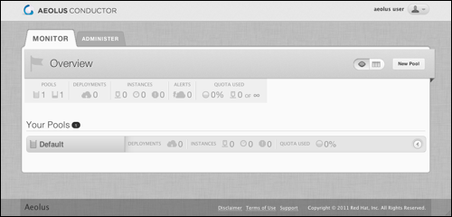
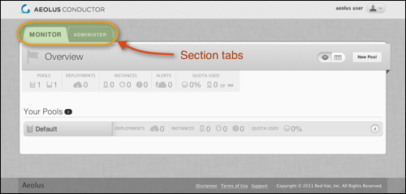
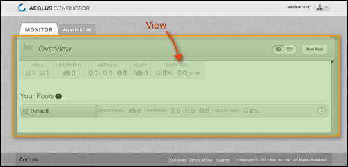
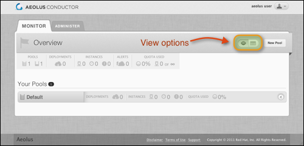
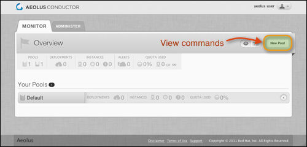
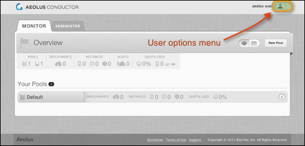
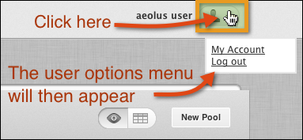
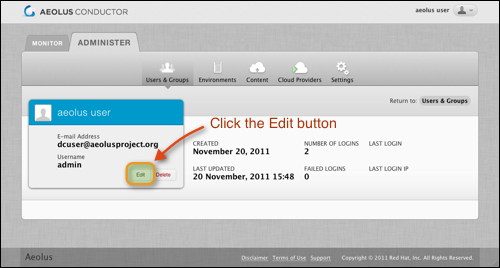
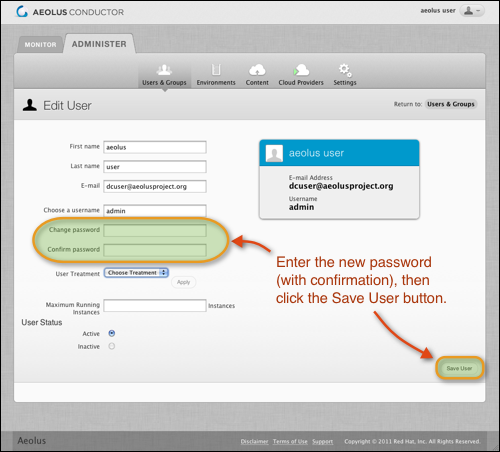
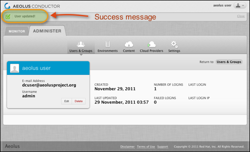

{::options parse_block_html="true" /}

First login
===========

On this page, you will log into Aeolus, be introduced to the main parts
of the web based interface, and change the administrator password.

### Getting Started Guide

1.  [Basic Glossary](basic_glossary.html "Basic Glossary")
2.  [Configuring Aeolus](configuring_aeolus.html "Configuring Aeolus")
3.  First login
4.  [Configure your Cloud
    Providers](configure_providers.html "Configure your Cloud Providers")
5.  [Configure the Aeolus Command Line Interface
    tool](configure_cli.html "Configure the Aeolus Command Line Interface tool")
6.  [Create a Fedora 16
    Template](make_template.html "Create a Fedora 16 Template")
7.  [Start an Instance of the
    Image](start_image.html "Start an Instance of the Image")
8.  [Stop a running Instance](stop_image.html "Stop a running Instance")
9.  [Cleaning up](cleaning_up.html "Cleaning up")

## 1. Web based interface

After Aeolus has been initialized, with any firewall updates done, you
are ready to use the web interface.

Open the following address in your web browser (any modern one), using
the name of your Aeolus server instead of "**server\_name**":

    https://server_name/conductor

**USEFUL INFO:** Aeolus is really [several pieces of software that work
together.](https://www.aeolusproject.org/redmine/projects/aeolus/wiki/Aeolus_Components)
"Conductor" is the web based user interface piece.

If everything is working properly, the initial login screen will appear:

Login now, using the default administrator details set by
**aeolus-configure**:

       **Username:** admin  
       **Password:** password

We'll change that password in a few moments, after introducing you to
the major parts of the Aeolus interface.

 

## 2. Welcome screen

Once you've logged in, the main Aeolus web interface appears:

The important parts are:

**Section tabs** 

These are the "**MONITOR**" and "**ADMINISTER**" tabs in the screenshot.

-   Clicking the *Monitor* tab switches to the Monitoring view. This
    is where the status and progress of your virtual machines is
    shown.

	

    **NOTE -** This view is the default when you log in. Clicking on
    *Monitor* when you're already in this view has no effect.
    

-   Clicking the *Administer* tab switches the view to general
    configuration settings.

**View** 

This is the middle of the screen, from the "**Overview**" title bar down. It
includes everything down to (but not including) the page footer. The title,
options, and content in this area change as you perform different tasks in
Aeolus.

**View options** 

Some views, such as Monitor Overview, let you choose how data is displayed.
Conductor presents two views— **detail view** and **pretty view.** Pretty view
is represented by the "eyeball" icon and is the default view. It represents a
graphical overview of content. Detail view is represented by the "table" or
"grid" icon, and presents a more detailed view of content. In some cases,
detail view will present some controls that are not present in pretty view. For
now, we will stay in pretty view.

**View commands** 

View commands represent action buttons based on the objects you are viewing.
Depending on the page you are on, these actions may include creating a new
pool, deleting a user, launching an instance, etc.

**User options menu** 

The user menu contains actions for the currently logged-in user, including the
ability to edit your account preferences and to log out.

 

## 3. Change the administrator password

In the top right corner of the interface, click on the silhouette button
next to "**aeolus user**". The user options menu will appear.

Then click "**My Account**". This is a shortcut to your user information
view in the *Administer* sections' "**Users and Groups**" area.

Click the "**Edit**" button on the user's business card.

This loads the "**Edit User**" view:

Change the password now, using the "**Change password**" and "**Confirm
password**" fields.

If you want, also change the First name, Last name, and E-mail fields.

Click the "**Save User**" button when you're done. A message confirming
the change should appear:

<a class='button' href='configure_providers.html' title='Configure your Cloud Providers'>
  Configure your Cloud Providers 
</a>