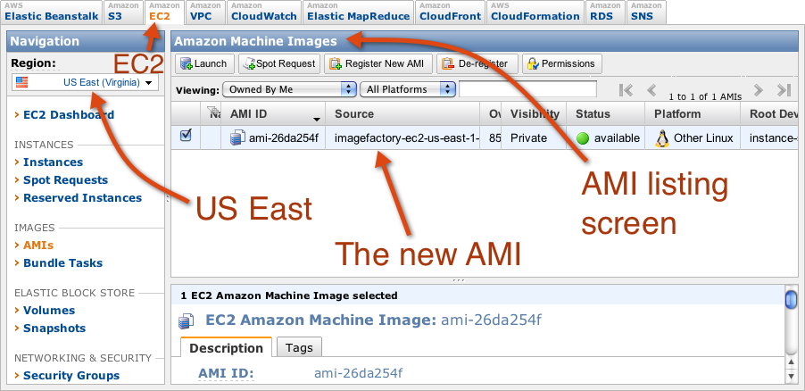

{::options parse_block_html="true" /}

Create a Fedora 16 Template
===========================

### Getting Started Guide

1.  [Basic Glossary](basic_glossary.html "Basic Glossary")
2.  [Configuring Aeolus](configuring_aeolus.html "Configuring Aeolus")
3.  [First login](first_login.html "First login")
4.  [Configure your Cloud
    Providers](configure_providers.html "Configure your Cloud Providers")
5.  [Configure the Aeolus Command Line Interface
    tool](configure_cli.html "Configure the Aeolus Command Line Interface tool")
6.  Create a Fedora 16 Template
7.  [Start an Instance of the
    Image](start_image.html "Start an Instance of the Image")
8.  [Stop a running Instance](stop_image.html "Stop a running Instance")
9.  [Cleaning up](cleaning_up.html "Cleaning up")

## 1. Create the template

Create an XML file with the following content in it; the file name and
extension doesn't matter. Be sure to change the "rootpw" element.

    <template>
      <name>Fedora 16 Template</name>
      <os>
        <name>Fedora</name>
        <version>16</version>
        <arch>x86_64</arch>
        <install type='url'>
          <url>http://download.fedoraproject.org/pub/fedora/linux/releases/16/Fedora/x86_64/os/</url>
        </install>
        <rootpw>p@ssw0rd</rootpw>
      </os>
      <description>A Fedora 16 Image Factory Template</description>
      <commands>
        <command name="F16 updates">yum update -y</command>
      </commands>
    </template>

 

## 2. Build and transfer the image

Now use the aeolus-image command-line tool to build the image described
in the XML.

    $ aeolus-image build --target ec2,mock --template template.xml --environment default

    Target Image                             Target     Status        Image                                    Build
    ------------------------------------     ------     ---------     ------------------------------------     ------------------------------------
    1306b29e-a30e-4efd-a1fb-09753863d77c     ec2        COMPLETED     6214d1b6-7292-436f-9c62-f0852e469f70     995535c8-ee70-407c-9413-12d274bbdd1d
    b33236d7-81b9-41b0-96f9-d039acd60537     mock       COMPLETED     6214d1b6-7292-436f-9c62-f0852e469f70     995535c8-ee70-407c-9413-12d274bbdd1d

    Target Image: 663ad46e-709f-4ea1-89f0-e73b8bb2205a
    Image: 6214d1b6-7292-436f-9c62-f0852e469f70
    Build: 3b5624b1-c9a5-48e2-b6cb-2abecd232eb9
    Status: COMPLETED
    Percent Complete: 100

**NOTE -** The Image value is important.

We use it in a few steps below. If you lose it, you can always find it
by typing:

    aeolus-image list --images

Environments can be used to group deployments together. Out of the box,
aeolus-configure sets up a "default" environment that you may use.

When building for EC2, this occurs in the form of a "snapshot build"
that occurs in the cloud using your EC2 credentials. For all other
providers, Image Factory will build an image locally inside of a virtual
machine, so hardware virtualization support is required.

Once an image is built, we push it to a **Cloud Provider** using the
account configured earlier.

aeolus-image just needs the Provider Account name (ec2\_east) and the
Image UUID given by the last command
(6214d1b6-7292-436f-9c62-f0852e469f70). To push to the mock provider
account, simply use "mock" as the account name.

    $ aeolus-image push -A ec2_east -I 6214d1b6-7292-436f-9c62-f0852e469f70
    Target Image: 2814a4e5-67a1-4dc3-b8be-8977bca61e8b
    Provider Image: 19d97c85-3db3-41fa-bf92-63fb6fed738a   Status: New

Building and pushing can take some time, except for the mock provider.
You can watch its progress by tailing the Image Factory and Image
Warehouse logs:

    $ tail -20f /var/log/imagefactory.log
    [verbose progress information appears here]

    $ tail -20f /var/log/iwhd.log
    [verbose progress information appears here]

You will know it has finished when the output in the log file ceases
after displaying an entry like this:

    2011-11-24 10:08:49,375 DEBUG imgfac.ImageWarehouse.ImageWarehouse pid(3698) Message: Setting metadata ({'latest_unpushed': None})
    for http://localhost:9090/images/609a6eee-5ec5-4b13-8486-7491d091f8dc

 

## 3. Verifying on the Amazon Cloud side

If you pushed the template to your Amazon EC2 account, load Amazon's AWS
Management Console in your web browser. You will see this image in your
list of registered AMI's:

<a class='button' href='start_image.html' title='Start An Instance Of An Image'>
  Start Image 
</a>